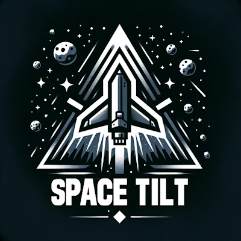

# SpaceTilt

SpaceTilt is an exciting space-themed game where players navigate a spaceship through an asteroid field using gyroscope controls. The game is designed to run on an RP2040 microcontroller with a GC9A01 display and QMI8658 accelerometer.

Originally I need to understand was how to visualise the Gyro features of the board, the display had no touch so needed another way to see how it worked. The idea was if I could balance a drop of water on the display I could see the Gyro numbers - I replaced the drop of water with the space ship and __SpaceTilt__ was born.

## Features

- **Gyroscope Controls**: Tilt your device to control the spaceship's movement.
- **Asteroid Field**: Navigate through randomly generated asteroids.
- **Timers and Scoring**: Track how long you survive in the game.
- **Splash Screen and Game Over Screen**: Enhances the gaming experience with visual feedback.

## How to Play

1. **Initialization**: The game starts with a splash screen.
2. **Controls**: Use the device's tilt to control the spaceship.
3. **Objective**: Avoid colliding with asteroids for as long as possible.
4. **Game Over**: When a collision occurs, the game displays a "Game Over" screen with your survival time.

## What next

* Android and iOS watch game port (what framework to use)

## Setup and Installation

1. **Hardware Requirements**:
    - RP2040 microcontroller
    - GC9A01 display
    - QMI8658 accelerometer
2. **Software Requirements**:
    - [MicroPython firmware for the WaveShare LCD 1.28" GC9A01 display.](https://github.com/russhughes/gc9a01_mpy/blob/main/firmware/RPI_PICO/firmware.uf2)
3. **Installation**:
    - Clone this repository to your local machine.
    - Upload the `main.py`, `qmi8658.py`, and `tft_config.py` files to your RP2040 board.
    - Ensure the `splash.jpg` image is in the `/assets/` directory on your board.

## Code Attribution

- **John Powell**: Took the original idea and made SpaceTilt.
- **Russ Hughes** (GitHub: [russhughes](https://github.com/russhughes)): Portions of the code, especially for the display driver, and game components.

## License

This project is open-source and available under the [MIT License](LICENSE).
